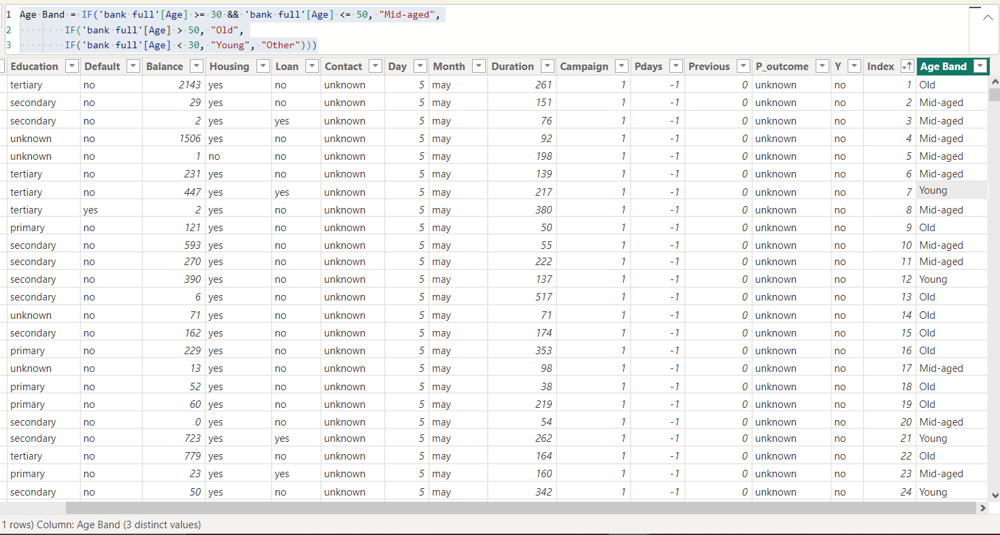
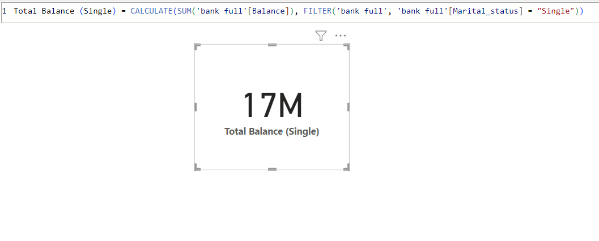

# Trust MFB Loans and Savings - A Fundamental Banking Analysis

Photo Source: https://cdn.punchng.com/wp-content/uploads/2018/12/24044354/Banking-hall.jpg

## INTRODUCTION
This is a Microsoft Power BI project on the financial analysis of deposits made in an imaginary financial institute named “Trust Bank” that deals in  Analyzing this bank’s yearly deposits and loans is essential for evaluating its performance to its customers and accountability, this will in turn help us make informed decisions, and ensure long-term sustainability and productivity in the banking sphere. This process involves a comprehensive assessment of the bank's daily deposits, loans and balance of each depositor, taking into account the important details of the bank customers. 

**_Disclaimer_** ⚠️- _All datasets and reports do not represent any real financial institute, organization or company, but just a dummy dataset to demonstrate my strengths and capacity with Microsoft Power BI._

## PROBLEM STATEMENT
The primary goal of this analysis is to gain valuable insights into the operations of Trust Microfinance Bank, their depositors’ information and loan systems. To do these, we will be answering some specific questions and task using DAX functions:
- Create a measure for the ‘Average age of depositors’
- Create a new column named ‘Age band’ containing the following: ‘Young’ for ages below 30; ‘Mid-aged’ for ages between 30 and 50; ‘Old’ for ages above 50
- Create a measure calculating the total balance for: Job: Technician; Marital: Single and Married
- Create a measure to get the number of depositors on Loan
- Finally, a visual will be created displaying important KPIs (Key Performance Index)

## SKILLS DEMONSTRATED
In this project, I explored most of Power BI’s functions. The following were used in this project: Data cleaning using power query editor, DAX functions, visualization (column, bar, line, donut, and pie charts), conditional formatting and data modelling.

## DATA SOURCING
The dataset was provided as an Excel CSV file, which was imported into our Power BI software. The dataset comprised of a table with 17 columns and 45211 rows containing information about the bank’s depositors and their loan histories.

## DATA WRANGLING
The data was imported and transformed using power query editor. The data was further examined for null values, duplicates and errors that may affect analysis. An index column was also created to help with our count analysis.

## ANALYSIS AND VISUALIZATION

1. The dataset was imported from an external source in a CSV format into Power BI and then transformed using power query editor.

2. The Average age of the depositors was calculated by creating a new measure using the AVERAGE DAX function.

3. A calculated column "Age Band" was created with conditional formatting, which put the age of the bank's depositors in categories. The conditional formatting was done using the IF DAX function.

<pre><code id="sqlQuery"> CODE:✍️
Age Band = IF('bank full'[Age] >= 30 && 'bank full'[Age] <= 50, "Mid-aged",
        IF('bank full'[Age] > 50, "Old",
        IF('bank full'[Age] < 30, "Young", "Other")))
</code></pre><button class="btn" data-clipboard-target="#sqlQuery">

4. The total balance for depositors who were 'Technicians' by career was calculated using the CALCULATE and FILTER DAX functions.

<pre><code id="sqlQuery"> CODE:✍️
Total Balance (Technician) = CALCULATE(SUM('bank full'[Balance]), FILTER('bank full', 'bank full'[Job] = "Technician"))
</code></pre><button class="btn" data-clipboard-target="#sqlQuery">

5. The total balance for depositors who were married and the singles (let the singles breef😆) were calculated using the CALCULATE and FILTER DAX functions.

<pre><code id="sqlQuery"> CODE:✍️
Total Balance (Married) = CALCULATE(SUM('bank full'[Balance]), FILTER('bank full', 'bank full'[Marital_status] = "Married"))
  
Total Balance (Single) = CALCULATE(SUM('bank full'[Balance]), FILTER('bank full', 'bank full'[Marital_status] = "Single"))
</code></pre><button class="btn" data-clipboard-target="#sqlQuery">

                                                          |                                               
:-------------------------------------------------------------------------------------:|:--------------------------------------------------------------------------------------------:

6. The Number of depositors on loan was calculated using CALCULATE and COUNT DAX functions.

<pre><code id="sqlQuery"> CODE:✍️
Number of Depositors on Loan = CALCULATE(COUNT('bank full'[Loan]), FILTER('bank full', 'bank full'[Loan] = "Yes"))
</code></pre><button class="btn" data-clipboard-target="#sqlQuery">

### Dashboard Presentation
This is a visual presentation depicting all the important KPIs from our analysis and important questions answered for insight.

## CONCLUSION
- The financial institute ia a very important institute and the emergence of Microfinance banks for daily deposits and issuance of loans has really helped small and medium enterprices (SMEs) in their daily business activities.
- It can been seen from the dashboard that this bank caters to different individuals with different job specifications and educational background.
- It can be seen that secondary school certificate holders are the most frequent customers in this bank for this year alone.
- It also recorded that only 7244 depositors were on loan, out of 45211 transactions in this year. I hereby suggest that loans should be made more available and accessible to customers with structured and easy pay-back systems.

**Thank you!** 🙇‍♀️

